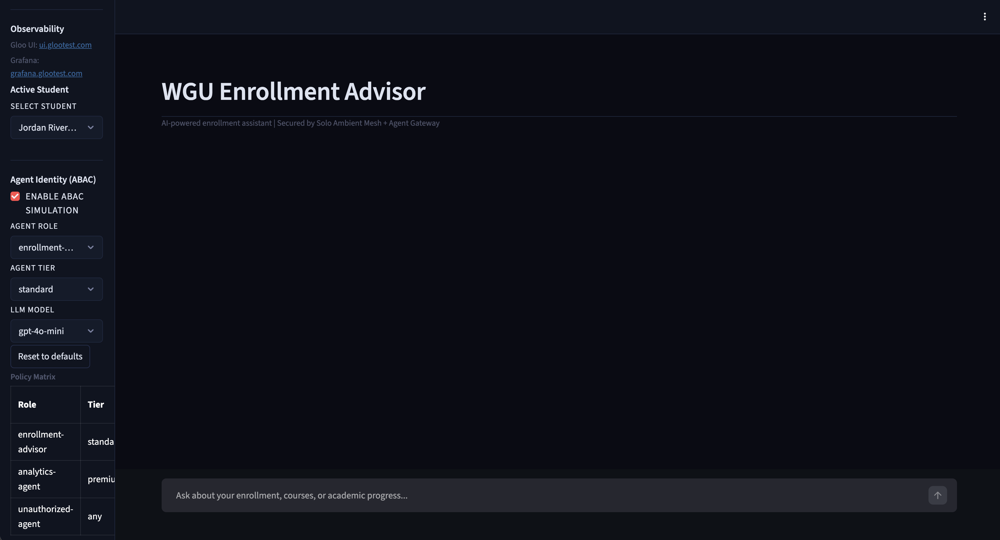
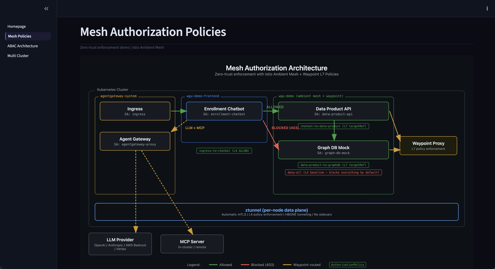
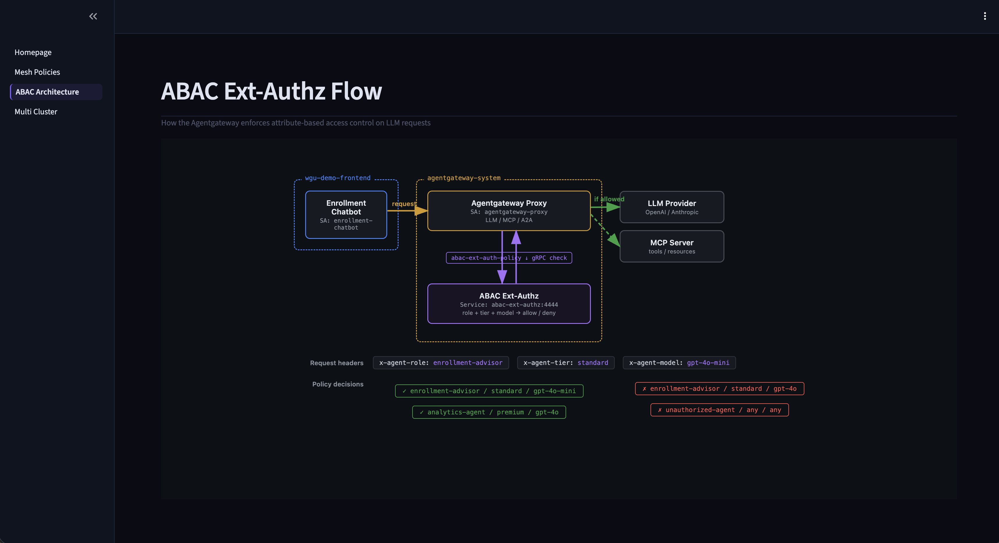
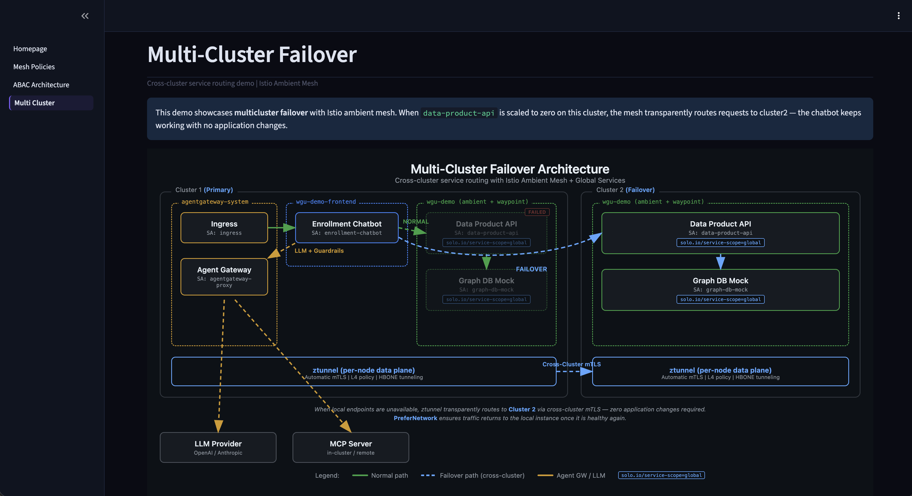

# Enrollment Agent Demo

An end-to-end AI enrollment chatbot secured by **Istio Ambient Mesh** and **Solo Enterprise Agentgateway**. The full request chain — student, chatbot, agent gateway (guardrails, rate limits), LLM, data product API (via mesh, mTLS), graph DB — is secured, observable, and governed with zero custom security code.


## Architecture

```
Student Browser
  → Ingress Gateway (LoadBalancer :80)
    → Enrollment Chatbot (Streamlit)
      → Agent Gateway (guardrails, rate limiting, tracing) → LLM Provider
      → Data Product API ──(mTLS via ambient mesh)──→ Graph DB Mock
```

**Key components:**

- **Ambient mesh** — ztunnel provides automatic mTLS between all workloads, no sidecars
- **Waypoint proxy** — L7 policy enforcement via AuthorizationPolicy
- **Agent Gateway** — PII guardrails (FERPA compliance), prompt injection protection, token rate limiting, distributed tracing
- **Function calling** — OpenAI-compatible tool use; the LLM requests student data and the chatbot executes calls through the mesh

## Demo Pages

| Page | Description |
|------|-------------|
| **Homepage** | AI enrollment chatbot with function calling and student selector |
| **Mesh Policies** | Live zero-trust policy enforcement — toggle AuthorizationPolicies on/off |
| **ABAC Architecture** | BYO ext-authz ABAC demo with gRPC external authorization |
| **Multi-Cluster** | Multicluster failover between two clusters |

### Homepage



### Mesh Authorization Policies



### ABAC Ext-Authz



### Multi-Cluster Failover



## Workshops

- [**Full Workshop**](workshop.md) — 7-section walkthrough covering mesh security, guardrails, observability, function calling, and BYO ABAC ext-authz

## Prerequisites

- Two Kubernetes clusters (`cluster1`, `cluster2` contexts)
- [Solo trial license key](https://www.solo.io/free-trial/)
- OpenAI API key

## Quick Start

We recommend working through the [workshop](workshop.md) first — it walks through the architecture, mesh security, guardrails, and observability step by step.

Once you've completed the workshop and want to stand up the full environment quickly, the install script automates everything:

```bash
export SOLO_TRIAL_LICENSE_KEY=<key>
export OPENAI_API_KEY=<key>

./install.sh
```

The installer presents two modes:
1. **Full** — installs everything end-to-end (Istio, Agent Gateway, workloads)
2. **Demo-only** — deploys workloads onto existing infrastructure

After install, add DNS entries pointing to the ingress LoadBalancer IP or configure your external DNS to the following hostnames:

```
# /etc/hosts
<INGRESS_IP>  enroll.glootest.com  grafana.glootest.com  ui.glootest.com
```

Then access:

| URL | Service |
|-----|---------|
| http://enroll.glootest.com | Enrollment chatbot |
| http://grafana.glootest.com | Grafana (admin / prom-operator) |
| http://ui.glootest.com | Gloo UI (traces) |

## Configuration

All branding and service URLs are configurable via environment variables in `k8s/services/enrollment-chatbot.yaml`:

| Variable | Purpose |
|----------|---------|
| `ORG_NAME` | Full organization name in system prompt |
| `ORG_SHORT` | Short name for titles |
| `APP_TITLE` | Page title and sidebar header |
| `DATA_PRODUCT_URL` | Student data API endpoint |
| `GRAPH_DB_URL` | Graph DB endpoint |
| `NS_BACKEND` / `NS_FRONTEND` | Namespace names for kubectl commands |
| `STUDENTS_JSON` | Override student list as JSON array |
| `SYSTEM_PROMPT` | Override the entire system prompt |

## Guardrails

Defined in `k8s/gateway/guardrails.yaml`. Protections include:

- **PII detection** (FERPA) — blocks SSNs, credit cards, emails, phone numbers
- **Prompt injection** — blocks common jailbreak patterns
- **Credential leakage** — blocks AWS keys, API keys, private keys, passwords
- **Response masking** — redacts PII in LLM output

## Building

> **Note:** The default Docker Hub registry is `ably7/`. Update the image references in `build-and-redeploy.sh` and `k8s/services/` manifests to point to your own registry before building.

```bash
# Rebuild and deploy the chatbot (auto-increments version)
./build-and-redeploy.sh

# Explicit version
./build-and-redeploy.sh 0.0.1
```

Images are multi-arch (amd64/arm64).

## Testing

```bash
# Graph DB mock
cd services/graph-db-mock && PYTHONPATH=. pytest tests/ -v

# Data product API
cd services/data-product-api && PYTHONPATH=. pytest tests/ -v
```

## Cleanup

```bash
./cleanup.sh
```

## Project Structure

```
├── demo-ui/                    # Streamlit enrollment chatbot
│   ├── Homepage.py             # Chat interface with function calling
│   ├── pages/                  # Additional demo pages
│   ├── utils/                  # Config, theme, gateway helpers, kubectl wrapper
│   └── assets/                 # Architecture diagrams
├── services/
│   ├── abac-ext-authz/         # ABAC gRPC ext-authz server (Go)
│   ├── data-product-api/       # FastAPI — proxies to graph DB
│   └── graph-db-mock/          # FastAPI — canned student data
├── k8s/
│   ├── namespaces.yaml         # Ambient-labeled namespaces
│   ├── services/               # Deployments, Services, ServiceAccounts
│   ├── mesh/                   # AuthorizationPolicies, waypoint, telemetry
│   └── gateway/                # Backend, HTTPRoute, guardrails, rate limit
├── install.sh                  # Full install (or demo-only mode)
├── cleanup.sh                  # Tear down everything
├── build-and-redeploy.sh       # Quick chatbot rebuild cycle
├── workshop.md                 # 6-section workshop document
└── workshop-byo-abac-ext-authz.md  # ABAC ext-authz workshop
```

## Version Requirements

| Component | Version |
|-----------|---------|
| Istio | 1.29.0+ |
| Enterprise Agent Gateway | v2.3.0+ (tracing requires 2.3+) |
| Gateway API CRDs | Experimental channel (TLSRoute required) |
